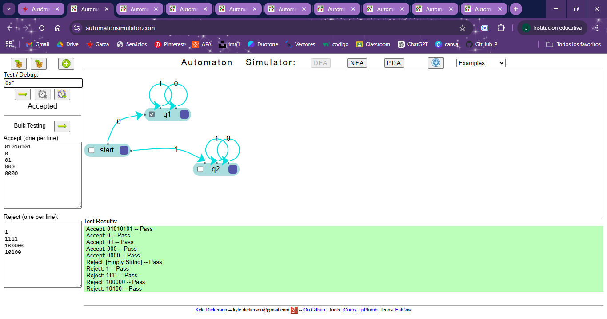
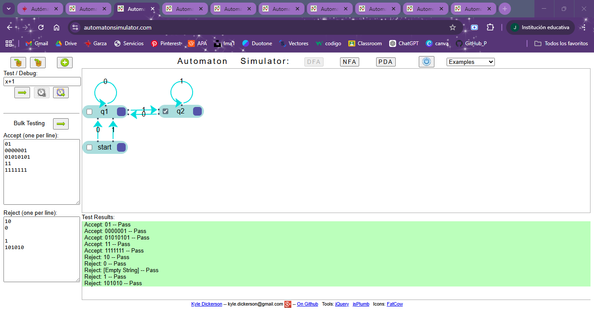
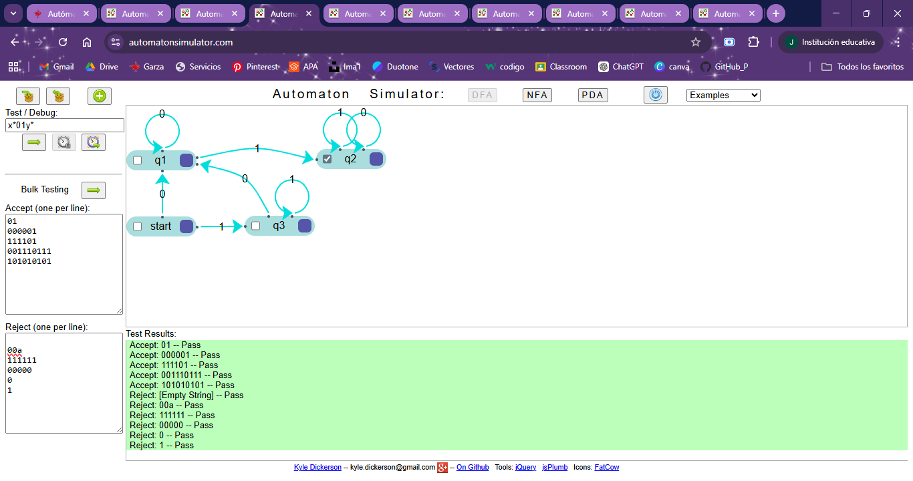
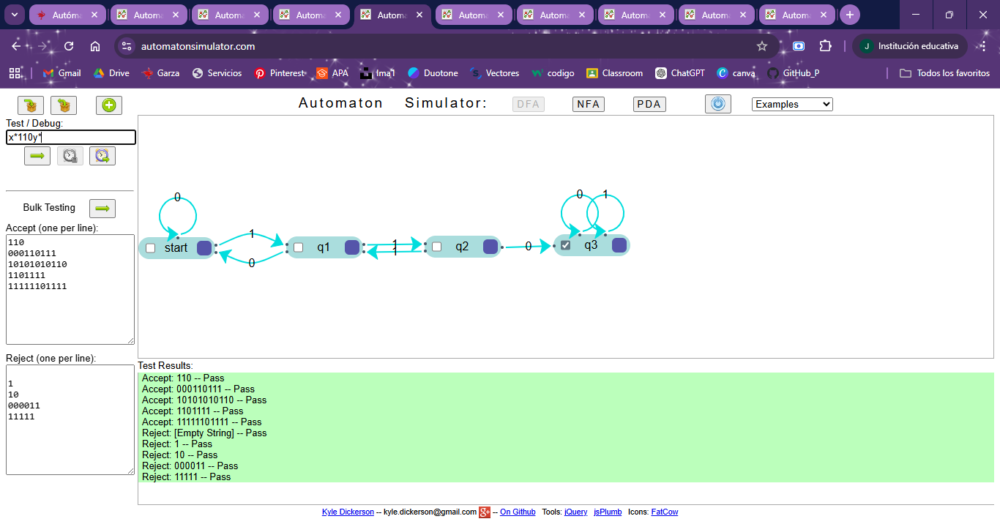
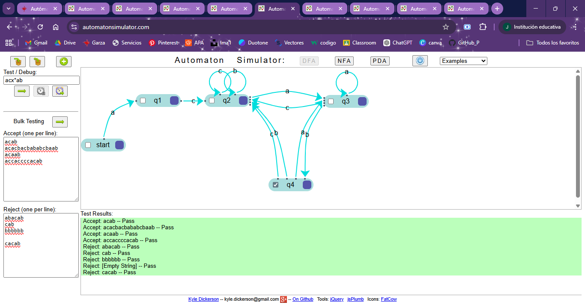
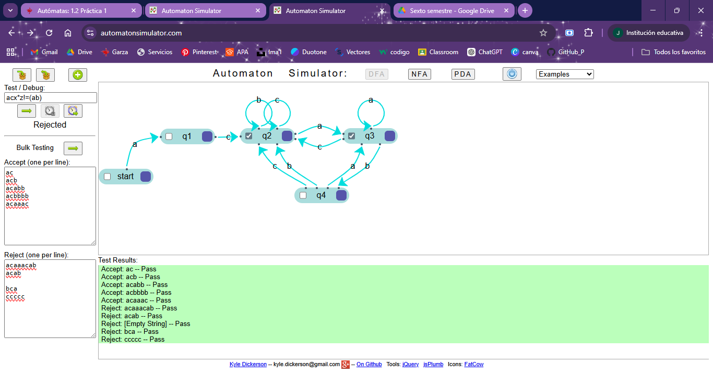
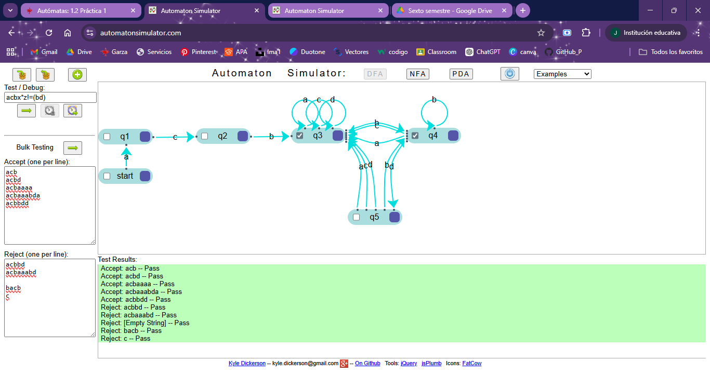
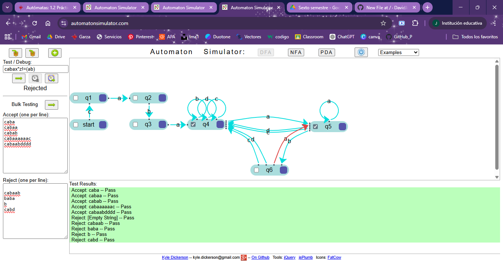
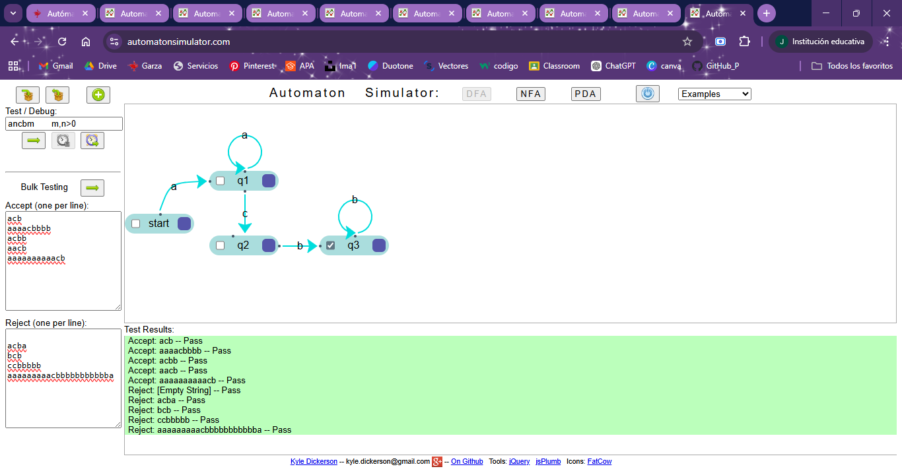
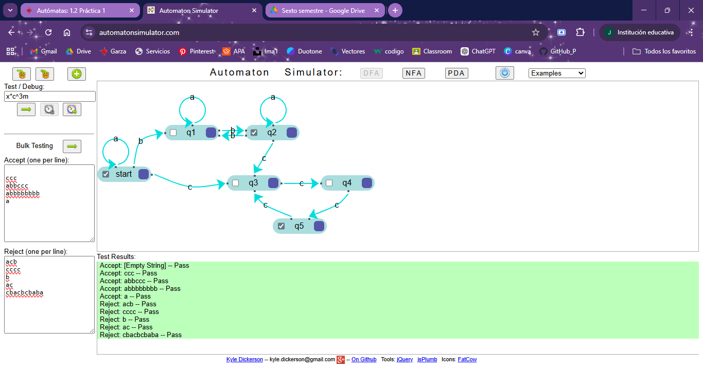

# Práctica 2: Reconocimiento de palabras con Autómatas Finitos Deterministas

**UAEH - ICBI**  
**Licenciatura en Ciencias Computacionales | 6° “3”**  
**Alumno:** José David Jácome Cayetano  
**Catedrático:** Eduardo Cornejo Velázquez  

---

# 1. Ejercicio 1

## Lenguaje
L = {0x | x ∈ {0,1}*}

## Tabla de Elementos del AFD

| Elementos | Valores |
|------------|----------|
| Σ | {0,1} |
| Q | {q₀, q₁, q₂} |
| δ | f(q₀,0)=q₁   f(q₀,1)=q₂   f(q₁,0)=q₁   f(q₁,1)=q₁   f(q₂,0)=q₂   f(q₂,1)=q₂ |
| q₀ | q₀ |
| F | {q₁} |

## Tabla de Transición

| Estado | 0 | 1 |
|---------|---|---|
| ⇝q₀ | q₁ | q₂ |
| ⋇q₁ | q₁ | q₁ |
| q₂ | q₂ | q₂ |

---

# 2. Ejercicio 2

## Lenguaje
L = {x1 | x ∈ {0,1}+}

## Tabla de Elementos del AFD

| Elementos | Valores |
|------------|----------|
| Σ | {0,1} |
| Q | {q₀, q₁, q₂} |
| δ | f(q₀,0)=q₁   f(q₀,1)=q₁   f(q₁,0)=q₁   f(q₁,1)=q₂   f(q₂,0)=q₁   f(q₂,1)=q₂ |
| q₀ | q₀ |
| F | {q₂} |

## Tabla de Transición

| Estado | 0 | 1 |
|---------|---|---|
| ⇝q₀ | q₁ | q₁ |
| q₁ | q₁ | q₂ |
| ⋇q₂ | q₁ | q₂ |

---

# 3. Ejercicio 3

## Lenguaje
L = {x01y | x,y ∈ {0,1}*}

## Tabla de Elementos del AFD

| Elementos | Valores |
|------------|----------|
| Σ | {0,1} |
| Q | {q₀, q₁, q₂, q₃} |
| δ | f(q₀,0)=q₁   f(q₀,1)=q₃   f(q₁,0)=q₁   f(q₁,1)=q₂   f(q₂,0)=q₂   f(q₂,1)=q₂   f(q₃,0)=q₁   f(q₃,1)=q₃ |
| q₀ | q₀ |
| F | {q₂} |

## Tabla de Transición

| Estado | 0 | 1 |
|---------|---|---|
| ⇝q₀ | q₁ | q₃ |
| q₁ | q₁ | q₂ |
| ⋇q₂ | q₂ | q₂ |
| q₃ | q₁ | q₃ |

---

# 4. Ejercicio 4

## Lenguaje
L = {x110y | x,y ∈ {0,1}*}

## Tabla de Elementos del AFD

| Elementos | Valores |
|------------|----------|
| Σ | {0,1} |
| Q | {q₀, q₁, q₂, q₃} |
| δ | f(q₀,0)=q₀   f(q₀,1)=q₁   f(q₁,0)=q₀   f(q₁,1)=q₂   f(q₂,0)=q₁   f(q₂,1)=q₃   f(q₃,0)=q₃   f(q₃,1)=q₃ |
| q₀ | q₀ |
| F | {q₃} |

## Tabla de Transición

| Estado | 0 | 1 |
|---------|---|---|
| ⇝q₀ | q₀ | q₁ |
| q₁ | q₀ | q₂ |
| q₂ | q₁ | q₃ |
| ⋇q₃ | q₃ | q₃ |

---

# 5. Ejercicio 5

## Lenguaje
L = {acxab | x ∈ {a,b,c}*}

## Tabla de Elementos del AFD

| Elementos | Valores |
|------------|----------|
| Σ | {a,b,c} |
| Q | {q₀, q₁, q₂, q₃, q₄} |
| δ | f(q₀,a)=q₁   f(q₁,c)=q₂   f(q₂,a)=q₃   f(q₂,b)=q₂   f(q₂,c)=q₂   f(q₃,a)=q₃   f(q₃,b)=q₄   f(q₃,c)=q₂   f(q₄,a)=q₃   f(q₄,b)=q₂   f(q₄,c)=q₂ |
| q₀ | q₀ |
| F | {q₄} |

## Tabla de Transición

| Estado | a | b | c |
|---------|---|---|---|
| ⇝q₀ | q₁ | ∅ | ∅ |
| q₁ | ∅ | ∅ | q₂ |
| q₂ | q₃ | q₂ | q₂ |
| q₃ | q₃ | q₄ | q₂ |
| ⋇q₄ | q₃ | q₂ | q₂ |

---

# 6. Ejercicio 6

## Lenguaje
L = {acxz | x ∈ {a,b,c}*  y  z ≠ ab}

## Tabla de Elementos del AFD

| Elementos | Valores |
|------------|----------|
| Σ | {a,b,c} |
| Q | {q₀, q₁, q₂, q₃, q₄} |
| δ | f(q₀,a)=q₁   f(q₁,c)=q₂   f(q₂,a)=q₃   f(q₂,b)=q₂   f(q₂,c)=q₂   f(q₃,a)=q₃   f(q₃,b)=q₄   f(q₃,c)=q₂   f(q₄,a)=q₃   f(q₄,b)=q₂   f(q₄,c)=q₂ |
| q₀ | q₀ |
| F | {q₂, q₃} |

## Tabla de Transición

| Estado | a | b | c |
|---------|---|---|---|
| ⇝q₀ | q₁ | ∅ | ∅ |
| q₁ | ∅ | ∅ | q₂ |
| ⋇q₂ | q₃ | q₂ | q₂ |
| ⋇q₃ | q₃ | q₄ | q₂ |
| q₄ | q₃ | q₂ | q₂ |

---

# 7. Ejercicio 7

## Lenguaje
L = {acbxz | x ∈ {a,b,c,d}*  y  z ≠ bd}

## Tabla de Elementos del AFD

| Elementos | Valores |
|------------|----------|
| Σ | {a,b,c,d} |
| Q | {q₀, q₁, q₂, q₃, q₄, q₅} |
| δ | f(q₀,a)=q₁   f(q₁,c)=q₂   f(q₂,b)=q₃   f(q₃,a)=q₃   f(q₃,b)=q₄   f(q₃,c)=q₃   f(q₃,d)=q₃   f(q₄,a)=q₃   f(q₄,b)=q₄   f(q₄,c)=q₃   f(q₄,d)=q₅   f(q₅,a)=q₃   f(q₅,b)=q₄   f(q₅,c)=q₃   f(q₅,d)=q₃ |
| q₀ | q₀ |
| F | {q₃, q₄} |

## Tabla de Transición

| Estado | a | b | c | d |
|---------|---|---|---|---|
| ⇝q₀ | q₁ | ∅ | ∅ | ∅ |
| q₁ | ∅ | ∅ | q₂ | ∅ |
| q₂ | ∅ | q₃ | ∅ | ∅ |
| ⋇q₃ | q₃ | q₄ | q₃ | q₃ |
| ⋇q₄ | q₃ | q₄ | q₃ | q₅ |
| q₅ | q₃ | q₄ | q₃ | q₃ |

---

# 8. Ejercicio 8

## Lenguaje
L = {cabaxz | x ∈ {a,b,c,d}*  y  z ≠ ab}

## Tabla de Elementos del AFD

| Elementos | Valores |
|------------|----------|
| Σ | {a,b,c,d} |
| Q | {q₀, q₁, q₂, q₃, q₄, q₅, q₆} |
| δ | f(q₀,c)=q₁   f(q₁,a)=q₂   f(q₂,b)=q₃   f(q₃,a)=q₄   f(q₄,a)=q₅   f(q₄,b)=q₄   f(q₄,c)=q₄   f(q₄,d)=q₄   f(q₅,a)=q₅   f(q₅,b)=q₆   f(q₅,c)=q₄   f(q₅,d)=q₄   f(q₆,a)=q₅   f(q₆,b)=q₄   f(q₆,c)=q₄   f(q₆,d)=q₄ |
| q₀ | q₀ |
| F | {q₄, q₅} |

## Tabla de Transición

| Estado | a | b | c | d |
|---------|---|---|---|---|
| ⇝q₀ | ∅ | ∅ | q₁ | ∅ |
| q₁ | q₂ | ∅ | ∅ | ∅ |
| q₂ | ∅ | q₃ | ∅ | ∅ |
| q₃ | q₄ | ∅ | ∅ | ∅ |
| ⋇q₄ | q₅ | q₄ | q₄ | q₄ |
| ⋇q₅ | q₅ | q₆ | q₄ | q₄ |
| q₆ | q₅ | q₄ | q₄ | q₄ |

---

# 9. Ejercicio 9

## Lenguaje
L = { aⁿ (cb)ᵐ | n > 0  y  m > 0 }

## Tabla de Elementos del AFD

| Elementos | Valores |
|------------|----------|
| Σ | {a,b,c} |
| Q | {q₀, q₁, q₂, q₃} |
| δ | f(q₀,a)=q₁   f(q₁,a)=q₁   f(q₁,c)=q₂   f(q₂,c)=q₂   f(q₂,b)=q₃   f(q₃,b)=q₃ |
| q₀ | q₀ |
| F | {q₃} |

## Tabla de Transición

| Estado | a | b | c |
|---------|---|---|---|
| ⇝q₀ | q₁ | ∅ | ∅ |
| q₁ | q₁ | ∅ | q₂ |
| q₂ | ∅ | q₃ | q₂ |
| ⋇q₃ | ∅ | q₃ | ∅ |

---

# 10. Ejercicio 10

## Lenguaje
L = { (ac)^(3m)  |  x ∈ {a,b}*  y  la cantidad de b es par,  m ≥ 0 }

## Tabla de Elementos del AFD

| Elementos | Valores |
|------------|----------|
| Σ | {a,b,c} |
| Q | {q₀, q₁, q₂, q₃, q₄, q₅} |
| δ | f(q₀,a)=q₀   f(q₀,b)=q₁   f(q₀,c)=q₃   f(q₁,a)=q₁   f(q₁,b)=q₂   f(q₂,a)=q₂   f(q₂,b)=q₁   f(q₂,c)=q₃   f(q₃,c)=q₄   f(q₄,c)=q₅   f(q₅,c)=q₃ |
| q₀ | q₀ |
| F | {q₀, q₂, q₅} |

## Tabla de Transición

| Estado | a | b | c |
|---------|---|---|---|
| ⇝⋇q₀ | q₀ | q₁ | q₃ |
| q₁ | q₁ | q₂ | ∅ |
| ⋇q₂ | q₂ | q₁ | q₃ |
| q₃ | ∅ | ∅ | q₄ |
| q₄ | ∅ | ∅ | q₅ |
| ⋇q₅ | ∅ | ∅ | q₃ |

---

# Preguntas Teóricas

## ¿Cuáles son los elementos que definen un AFD?

Un AFD se define como la 5-tupla (Q, Σ, δ, q₀, F).

## ¿Cuál es la utilidad de la tabla de transiciones?

Permite visualizar y verificar formalmente el comportamiento del autómata.

## ¿Qué importancia tienen los diagramas?

Facilitan el diseño conceptual y la comprensión visual.

## ¿Cuáles son las ventajas de la simulación?

Permite validar cadenas y comprobar el lenguaje reconocido.

---

# Bibliografía

- Giró, J. et al. (2015). *Lenguajes formales y teoría de autómatas*. Alfaomega.
- Ruiz Catalán, J. (2010). *Compiladores: teoría e implementación*. Alfaomega.
- Brookshear, J. G. (1995). *Teoría de la Computación*. Addison-Wesley.
